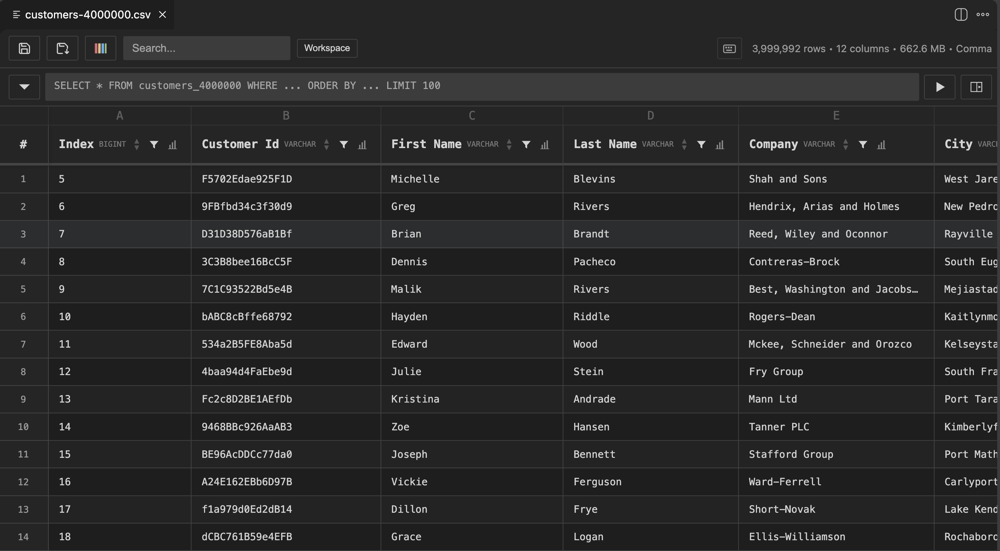
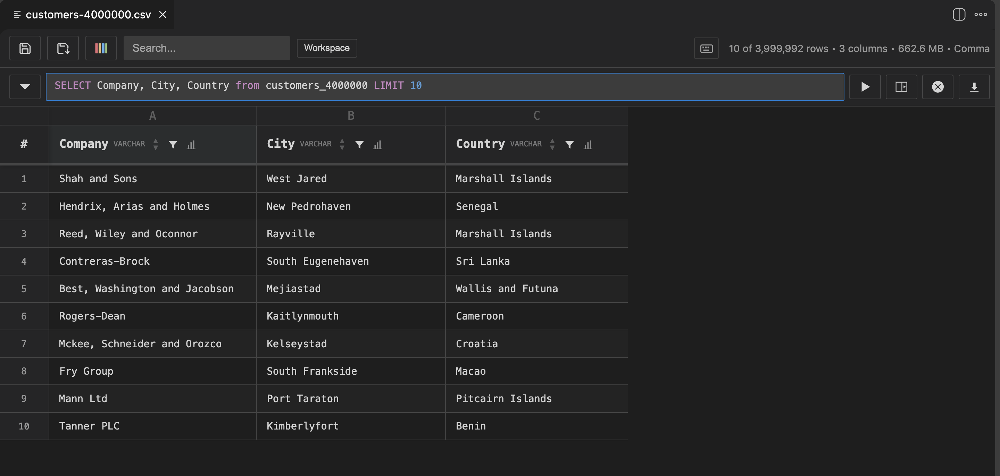

# DuckCSV

High-performance CSV/TSV/Parquet viewer powered by DuckDB. Edit, query, filter, and profile your data directly in VS Code.

<!-- IMMAGINE 1: Hero screenshot — la tabella aperta con dati, header colorati, row numbers visibili. Mostra il look & feel generale. -->
<!-- File: media/screenshots/hero.png -->
<!--  -->

## Features

### View & Navigate
- **Instant rendering** — Open files with millions of rows. Virtual scrolling keeps it smooth.
- **Parquet support** — Open `.parquet` files alongside CSV/TSV.
- **Auto-delimiter detection** — Comma, semicolon, tab, pipe — detected automatically.
- **Sticky headers** — Column headers stay visible as you scroll.
- **Column types** — DuckDB infers types (INTEGER, VARCHAR, DATE, etc.) and displays them in the header.

<!-- IMMAGINE 2: Tabella con molte righe, mostra lo scroll fluido e i tipi nelle header. -->
<!-- File: media/screenshots/table-view.png -->
<!--  -->

### Edit
- **Cell editing** — Double-click any cell to edit. Type changes are handled automatically.
- **Row operations** — Insert rows above/below, delete single or multiple rows via right-click.
- **Undo/Redo** — Full undo history with Cmd+Z / Cmd+Shift+Z.
- **Save** — Cmd+S writes back to the original file. Save As for a new file.

<!-- IMMAGINE 3: Cella in editing mode (bordo blu, input attivo) + context menu con Insert/Delete row. -->
<!-- File: media/screenshots/editing.png -->
<!--  -->

### Sort, Filter & Search
- **Column sort** — Click header arrows for ascending/descending sort.
- **Column filters** — Funnel icon opens a dropdown with unique values. Multi-select to filter.
- **Global search** — Search across all columns with highlighting. Debounced for performance.

<!-- IMMAGINE 4: Filter dropdown aperto su una colonna con checkbox e search. -->
<!-- File: media/screenshots/filter.png -->
<!--  -->

### SQL Queries
- **DuckDB SQL** — Write queries in the built-in query bar. Full DuckDB SQL support.
- **Inline or side panel** — Run queries inline (replaces current view) or in a separate panel.
- **Autocomplete** — Column names and table names autocomplete as you type.
- **Query history** — Access previous queries from the history dropdown.

<!-- IMMAGINE 5: Query bar con una SELECT scritta, autocomplete visibile, risultato inline. -->
<!-- File: media/screenshots/sql-query.png -->
<!--  -->

### Multi-Table Workspace
- **Load multiple files** — Open the workspace and load multiple CSV/TSV/Parquet files.
- **JOIN across files** — Run SQL JOINs between tables like a local database.
- **Table switching** — Switch between loaded tables with the dropdown.

<!-- IMMAGINE 6: Workspace con 2-3 tabelle caricate nella tables bar, query JOIN visibile. -->
<!-- File: media/screenshots/workspace.png -->
<!--  -->

### Data Profiling
- **Column stats** — Click the 📊 button on any column header to see: total rows, non-null count, unique values, null %, min, max, mean, median, std dev.
- **Selection stats** — Select cells in a single column to see count, sum, avg, min, max in the status bar. Calculated via SQL on the full dataset.

<!-- IMMAGINE 7: Side panel profiling aperto con le stat cards (Total Rows, Unique, Null%, Min, Max, Mean, ecc.) -->
<!-- File: media/screenshots/profiling.png -->
<!--  -->

<!-- IMMAGINE 8: Selection stats bar in basso con Count, Sum, Avg, Min, Max visibili. -->
<!-- File: media/screenshots/selection-stats.png -->
<!--  -->

### Copy & Export
- **Excel-like selection** — Click cells, drag rows/columns, Shift+click for ranges.
- **Copy with headers** — Cmd+C copies selection with headers and file delimiter.
- **Export** — Export query results or filtered data to CSV/TSV/Parquet.

## Getting Started

1. Open any `.csv`, `.tsv`, or `.parquet` file
2. Click the table icon in the top-right corner of the editor
3. That's it — you're in

**Commands:**
- `DuckCSV: Open Preview` — open the current file as an interactive table
- `DuckCSV: Open Workspace` — load multiple files and query across them

**Keyboard shortcuts:**
- `Cmd+K V` — Open preview for the current file
- `Cmd+S` — Save changes
- `Cmd+Z` / `Cmd+Shift+Z` — Undo / Redo
- `Cmd+C` — Copy selection
- Arrow keys / Tab — Navigate between cells

## Requirements

- VS Code 1.106.0+
- No external tools needed — DuckDB WASM is bundled

## License

Apache 2.0 — see [LICENSE](LICENSE)

## Acknowledgments

Thanks to Christophe Ricco for the support and feedback during development.
