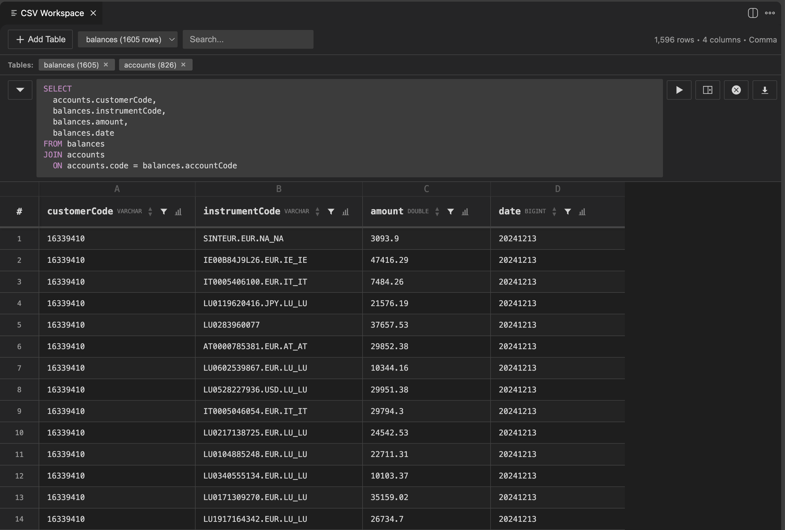

# DuckCSV

Interactive CSV/TSV viewer and editor for VS Code, powered by DuckDB WASM.

Open any CSV file and instantly get a sortable, filterable, queryable table — no extensions to configure, no external tools needed.

## Features

### View and Navigate

- Sticky headers with column type badges (VARCHAR, BIGINT, DOUBLE, DATE...)
- Sort by clicking column headers (asc → desc → none)
- Global search across all columns
- Column resize by dragging header borders
- Alternating row colors toggle for readability
- Row numbers with sticky positioning

### Filter and Query

- Per-column filter dropdowns with checkbox selection
- Full SQL query bar with DuckDB syntax
- Autocomplete for SQL keywords and column names
- Run queries inline or in a side panel
- Export query results to CSV

### Edit

- Double-click any cell to edit
- Insert rows above/below via right-click on row numbers
- Delete single or multiple rows (select + right-click)
- Auto type casting (VARCHAR ↔ BIGINT/DOUBLE/DATE)
- Changes saved directly to file (Edit mode) or to a copy (Read-only mode)

### Workspace (Multi-table)

- Open multiple CSV files as named tables
- Run SQL JOINs across tables
- Switch between tables with a dropdown

### Selection and Copy

- Click cell, row number, or column header to select
- Drag to select ranges
- Shift+click to extend selection
- Cmd+C copies with headers and original delimiter

## Getting Started

1. Open a CSV or TSV file in VS Code
2. Run `CSV: Open Preview (Read-only)` from the Command Palette (Cmd+K V)
3. To edit: run `CSV: Open Preview (Edit)`
4. To query multiple files: run `CSV: Open Workspace`

## Performance

- Handles files with millions of rows (DuckDB processes the full dataset)
- Displays up to 10,000 rows in the DOM
- Queries run in a worker thread — the editor stays responsive
- Cancel long-running queries with the stop button

## Requirements

- VS Code 1.106.0 or later
- No external dependencies needed (DuckDB WASM is bundled)

## Extension Settings

| Setting | Default | Description |
|---------|---------|-------------|
| `csv.previewRowCount` | 10000 | Rows to display |
| `csv.columnWidth.max` | 400 | Max column width (px) |
| `csv.columnWidth.min` | 50 | Min column width (px) |
| `csv.delimiter` | auto | Delimiter (auto, comma, semicolon, tab, pipe) |
| `csv.showRowNumbers` | true | Show row numbers |
| `csv.alternatingRowColors` | true | Alternating row colors |

## License

Apache 2.0 — see [LICENSE](LICENSE)
